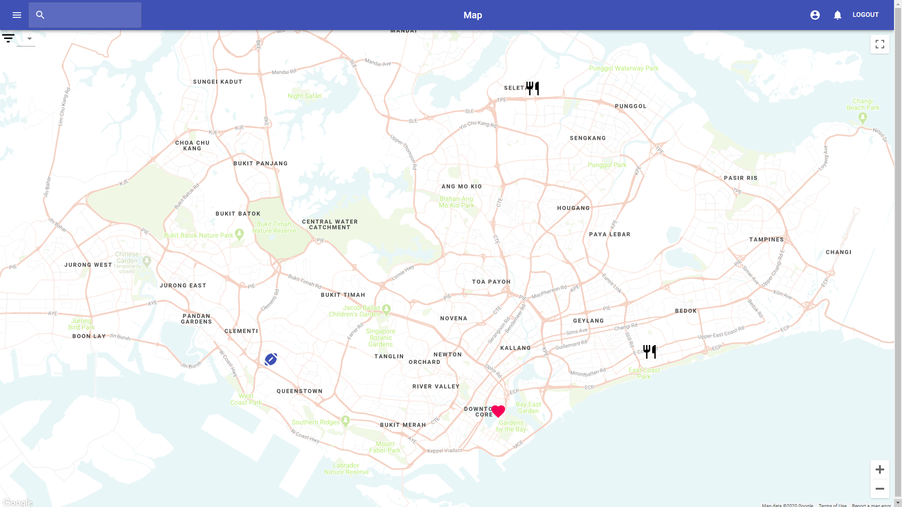

# Lifemap
Lifemap is a  platform that brings a social touch to the review space and helps our users find interesting and exciting places to go to. Lifemap consists of 2 main features: the E-Diary & the Interactive Map.The E-Diary feature provides users with the ability to view, create, modify and share diary entries. The Interactive Map feature serves as a live feed of a user’s social circles’ activities. 

## Features
* Create diary entries
* Customize your profile and follow other users
* Explore the interactive map and find new discoveries




## Getting Started
This section gets you set up to run LifeMap locally.

#### Prerequisites
You need to have NodeJS on your machine to run Lifemap. Either download it here: https://nodejs.org/en/download/ or run ```brew install node``` if you have Homebrew on macOS.

You also need to have a MySQL database server set up. Put your server credentials in your local env variables

#### Running
As with any ReactJS app, run ```npm install``` after cloning this repo. Then run ```npm start``` to build the client-side reactJS app.
To start Lifemap’s API server, run ```node server.js``` (or nodemon).

## What we use
#### Front-end
* ReactJS
* React-styled-components
* React-router

#### Back-end
* NodeJS with Express

